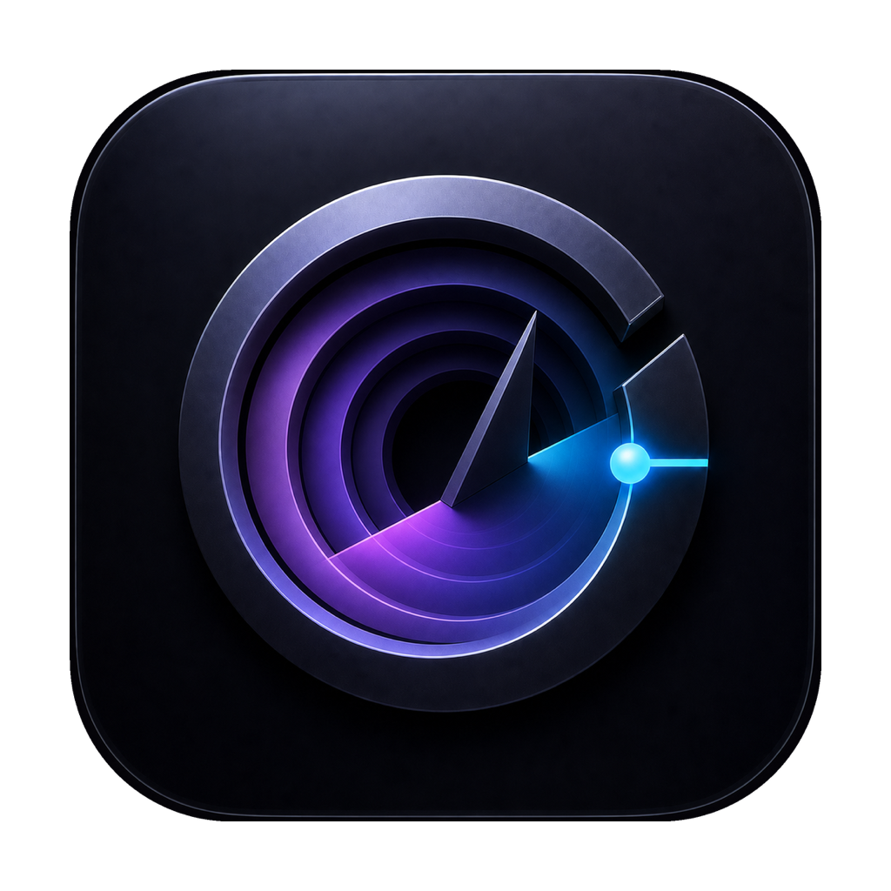
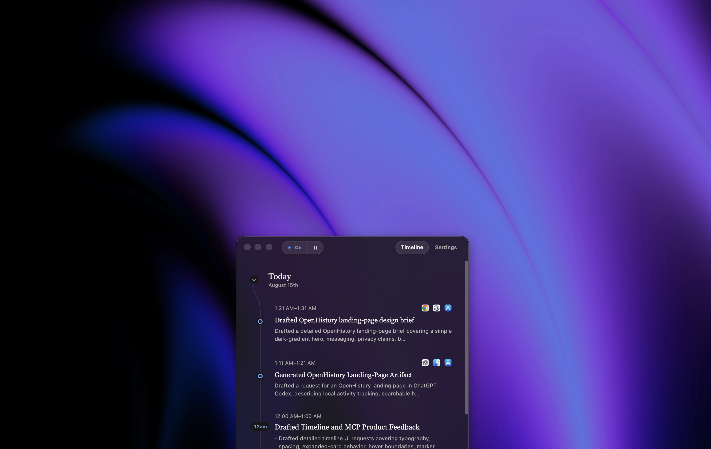

<p align="center">
  
</p>

<h1 align="center">OpenHistory</h1>

<p align="center">
  <strong>A private, searchable timeline of what you worked on.</strong>
</p>

<p align="center">
  <a href="https://openhistory.sh"><strong>openhistory.sh</strong></a>
</p>

<p align="center">
  <a href="https://openhistory.sh"></a>
</p>

<p align="center">
  <a href="https://github.com/ztratar/openhistory/actions/workflows/ci.yml"></a>
  
  <a href="LICENSE"></a>
</p>

<p align="center">
  
</p>

OpenHistory turns activity you permit on your Mac into a private record of your work. It builds a timeline, creates hourly and daily summaries, and gives approved local AI agents a controlled way to answer questions about what you did.

OpenHistory is under active development. It runs on macOS 14 or later and is currently installed from source.

## Why OpenHistory?

Work gets scattered across editors, browsers, terminals, documents, and issue trackers. By the end of the day, it can be surprisingly hard to remember what moved forward—or where you left off.

OpenHistory leaves you with a useful memory of the day without taking screenshots or recording every keystroke. You can use it to answer questions like:

> What did I finish yesterday?
>
> Where did I leave that release task?
>
> What work is still unfinished?

## What you get

- **An automatic work timeline.** Permitted foreground activity is grouped into clear work summaries.
- **Hourly and daily recaps.** OpenHistory turns work summaries into a history you can scan later.
- **Searchable out of the box.** Find past work immediately with built-in history search.
- **Choose your own inference.** Use Apple's experimental on-device model for maximum privacy—or connect OpenAI, Anthropic, or Kimi. Or simply turn off automatic summaries to keep just your logs.
- **Controlled agent access.** Local AI tools can search a redacted, read-only view through an authenticated MCP server.

## Privacy at a glance

| | OpenHistory behavior |
| --- | --- |
| **What it records** | Foreground application activity and permitted accessibility changes needed to create work summaries. |
| **What it never records** | Screenshots, audio, or individual key events. Password fields, private browser windows, and protected apps and websites are excluded. |
| **Where data lives** | Raw activity, summaries, settings, and agent credentials stay in a permission-restricted local data directory. |
| **When cloud models receive data** | Only after you choose a cloud provider, supply its key, and accept the provider-specific transmission disclosure. |
| **What agents can see** | A redacted projection—not the raw activity log—served over loopback with bearer authentication. |

Collection can be paused at any time. **Settings → Data & privacy → Delete all local data** removes recorded activity, summaries, settings, saved keys, and agent connections.

During first-run setup, email activity and recognized Messages/iMessage and chat activity are selected for inclusion by default. You can clear either selection before finishing setup and later control each category independently in Settings. Enabled email, messaging, or text-edit capture can contain sensitive text, so the local data directory should still be treated as private. Read the full [privacy policy](PRIVACY.md) and [security policy](SECURITY.md) before using OpenHistory with sensitive work.

## Quick start

### Download for Mac

The easiest way to get started is to [**download OpenHistory for Mac →**](https://openhistory.sh). No Node.js or Xcode setup is required.

OpenHistory requires macOS 14 or later. Apple's on-device summaries require Apple Intelligence on macOS 26 or later; OpenAI, Anthropic, and Kimi are available as optional alternatives.

### Build from source

If you'd rather inspect, modify, or build OpenHistory yourself, you'll need:

- macOS 14 or later
- Node.js 22
- Xcode with Swift 6.1 or later

```bash
git clone https://github.com/ztratar/openhistory.git
cd openhistory
npm ci
npm run dev
```

### First launch

On first launch, OpenHistory keeps collection paused until you accept the privacy notice. You will then choose how summaries should work:

- **Apple On-Device** keeps evidence on the Mac and requires no API key.
- **A cloud provider** requires its own API key and an explicit transmission disclosure.
- **Summaries off** keeps local collection running without model-generated timeline entries.

Keys entered in Settings are encrypted separately for each provider using macOS-backed Electron secure storage. They are never returned to the renderer, collector, or MCP clients.

<details>
<summary>Using environment variables instead of Settings</summary>

Copy the example file and add only the provider you want:

```bash
cp .env.example .env.local
```

OpenHistory reads ignored local environment files as a fallback. Supplying a key does not itself grant consent or enable cloud transmission; onboarding still requires the matching provider disclosure.

</details>

### Accessibility permission

Richer context requires macOS Accessibility permission. In OpenHistory, open **Settings** and choose **Grant access**. The development collector has a stable local permission identity at:

```text
native/collector/.build/debug/OpenHistory Collector.app
```

## Architecture

```text
macOS Accessibility APIs
          │
          ▼
Swift collector ──► permission-restricted JSONL
          │
          ▼
Electron main process ──► deterministic episodes
          │                      │
          │                      ▼ automatic update
          │          selected inference provider
          │                      │
          ▼                      ▼
React UI ◄──────── timeline + hour + daily-rollup indexes
                                 │
                                 ▼ sanitized projection
                     authenticated local MCP server
```

The renderer is sandboxed and communicates through a narrow typed preload bridge. Structured model outputs are validated before persistence. Raw events, indexes, Markdown, settings, and agent credentials are restricted to the current macOS user.

Inference inputs, prompts, schemas, limits, providers, and the native worker protocol are versioned and covered by preservation tests. See [the inference architecture](docs/architecture/inference.md) and [model-quality methodology](MODEL_QUALITY.md).

## Privacy model

- Collection can be paused at any time.
- When automatic summaries are enabled and the selected provider has an API key, completed episode evidence is sent directly to that provider about every 10 minutes.
- Chat requests send the conversation and relevant retrieved evidence to the configured cloud provider; questions about very recent work can include privacy-filtered activity not yet covered by a timeline summary.
- OpenAI requests use `store: false`; Anthropic and Kimi requests are governed by their respective API data policies.
- Credentials and credential-shaped text are redacted before persistence or projection.
- Raw activity is excluded from the MCP projection.
- Agent credentials are random, independently revocable, and stored only as SHA-256 hashes.
- The MCP server binds to `127.0.0.1`, requires bearer authentication, and rejects non-local browser origins.

See the complete [privacy policy](PRIVACY.md) and [SECURITY.md](SECURITY.md) for reporting security issues. Startup automatically removes historical protected activity and invalid derived summaries. To run that raw-event scrub manually, use:

```bash
npm run privacy:scrub-protected -- "/path/to/activity-data"
```

## Local agent access

In **Settings**, choose **Copy prompt** and paste it into your local coding agent. OpenHistory creates a dedicated, independently revocable credential for that connection. Credentials are sent in the `Authorization` header and are never placed in the MCP URL.

The read-only MCP tools can:

- search your work history;
- retrieve a day or timeline item;
- find referenced files, links, and other work surfaces;
- identify unfinished work.

The default endpoint is `http://127.0.0.1:47831/openhistory/mcp`.

## Where we'd love help

OpenHistory is still early, and some of the most interesting work is ahead of us. We'd especially welcome help with:

- **Exploring what's possible on Windows.** Investigate native activity collection, privacy boundaries, packaging, and which parts of the current macOS architecture can be shared.
- **Improving the local model.** Design an opt-in, privacy-preserving way for people to contribute human-corrected training examples for a future LoRA-based local model—without uploading raw activity logs.
- **Performance and battery life.** Measure and reduce the cost of running OpenHistory throughout the workday.
- **More agent integrations.** Improve the MCP experience across local agents and find useful new ways for them to work with personal history safely.
- **Privacy, accessibility, and app coverage.** Test unfamiliar macOS setups, strengthen protected-surface detection, and make onboarding work well for more people.
- **You name it.** If you see a better workflow, a missing safeguard, or a surprising use for OpenHistory, we'd like to hear it.

Start with the [contributing guide](CONTRIBUTING.md), or [open an issue](https://github.com/ztratar/openhistory/issues/new/choose) to propose an idea before building it.

## Development

```bash
npm test          # TypeScript and Swift tests
npm run build     # Native collector and Electron production bundles
npm run check     # Complete local quality gate
```

To build a complete local application without uploading anything to ToDesktop:

```bash
npm run desktop:package:local
```

Useful references:

- [Architecture and inference contracts](docs/architecture/inference.md)
- [Model-quality methodology](MODEL_QUALITY.md)
- [ToDesktop release process](docs/releasing-todesktop.md)
- [Contributing guide](CONTRIBUTING.md)

## License

OpenHistory is available under the [MIT License](LICENSE).
